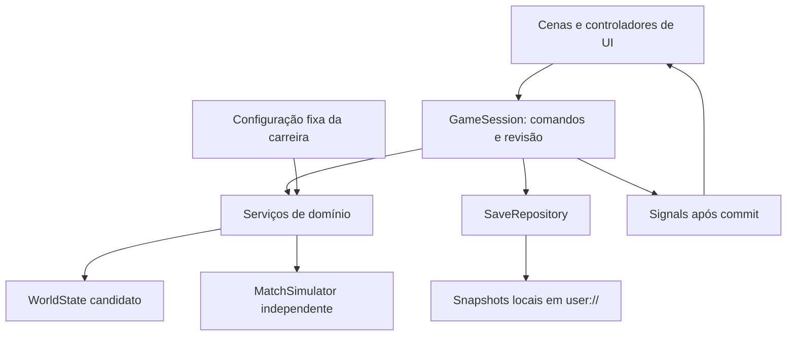

# Club Legacy — arquitetura técnica do MVP v1

**01/10/2026 · Game Architect · Game 001**

O proprietário aprovou o [GDD v1](../gdd/club-legacy-gdd-v1.md) como base desta etapa. Foram lidos [AGENTS.md](../../AGENTS.md), [Game Architect](../../agents/game-architect.md), [Godot Development](../../skills/godot-development/SKILL.md) e [conceito](../game-concepts/club-legacy-concept.md). Este documento e o [plano](../plans/club-legacy-mvp-plan.md) são propostas técnicas; nenhum projeto, cena ou script foi criado. Não substituem pendências de produto por balanceamento inventado.

## 1. Direção arquitetural e versão

Android, Godot, GDScript, offline-first e save local. Uma carreira contém o mundo inteiro: 12 clubes, cerca de 216 atletas iniciais, duas divisões e 60 partidas por temporada. Sem backend, rede, monetização, banco de dados externo, DRM ou IA generativa.

Adotar Godot 4.x estável, versão exata fixada no bootstrap junto com templates de exportação e ambiente de teste. A busca por `project.godot` no repositório não encontrou projeto existente; não há versão, renderer ou plugin já verificado. Evitar atualizar a engine durante um ciclo de validação sem testar replay/save. Não exigir addon de testes inicialmente.

Quatro limites simples:

- **Apresentação:** cenas Control e scripts de tela recebem dados para exibir e enviam comandos. Não sorteiam eventos, calculam preço, cobram salário ou aplicam resultado.
- **Aplicação:** uma sessão coordena comandos, estágio do calendário, validação e publicação de uma nova revisão do mundo.
- **Domínio:** modelos e serviços GDScript sem dependência de SceneTree, controles ou relógio real; preferir RefCounted para estado/serviços. Match Engine roda em processo headless.
- **Persistência/configuração:** serialização explícita, validação e gravação local; Resources de configuração tratados como somente leitura.

Não adotar ECS, contêiner de dependências, ORM, microserviços, event sourcing completo ou threads de mutação. Um escritor de estado por sessão, composição explícita de serviços e cópia candidata do mundo para operações compostas bastam ao tamanho inicial.



## 2. Estrutura proposta

Estrutura futura, não diretórios/arquivos criados nesta entrega:

```text
games/club-legacy/
  project.godot
  scenes/                 # Main e cenas de telas
  ui/                     # scripts de tela, componentes e tema
  scripts/
    application/          # GameSession, comandos, fluxo e projeções
    domain/
      models/             # estado e objetos de valor
      services/           # carreira, temporada, mercado, economia, IA
      match/              # estado, simulador e regras de partida
    persistence/          # mapeamento, validação, migração, save
  resources/config/       # Resources de regras/balanceamento
  data/                   # nomes e definição inicial fictícia
  assets/                 # recursos autorais mínimos
  tests/
    unit/
    integration/
    simulation/           # lotes de partidas/temporadas
    fixtures/             # mundos e snapshots sintéticos
```

Um projeto próprio sob `games/club-legacy/`; não mover serviços para `shared/` antes de reutilização comprovada. Separar modelos de regras, sem criar um diretório por entidade trivial. Recursos exportáveis de configuração devem ser carregados por ResourceLoader; dados textuais adicionais precisam inclusão explícita no export. [FileAccess oficial](https://docs.godotengine.org/en/stable/classes/class_fileaccess.html) documenta persistência local e ressalvas de recursos exportados.

## 3. Cenas e responsabilidade

Main, raiz persistente, possui controlador de navegação, um ScreenHost e uma área de notificações/diálogos. Instanciar apenas a tela necessária; tema/componentes compartilhados locais ao projeto. Árvore conceitual: Main → ScreenHost → tela atual; Main → DialogLayer. GameSession é Autoload separado dessa árvore de apresentação.

| Cena | Responsabilidade |
|---|---|
| StartCareer | Continuar/criar, nome, perfis, escolha e primeiro contrato |
| CareerHome | Próxima ação, alertas, emprego/vagas/renovação; avanço explícito |
| Club | Identidade, meta/confiança; finanças e estruturas como abas |
| Squad | Elenco e detalhes/contratos do atleta |
| Lineup | Onze/banco/formação/estratégia e validação |
| Market | Lista, ofertas e painel reutilizável de negociação |
| Match | Relógio/eventos, pause, comandos e resultado; controlador de apresentação |
| LeagueTable | Tabela, calendário, resultados e encerramento em painel |
| ManagerProfile | Histórico, títulos e reputação |

Empregos não precisam cena independente inicialmente: painel da CareerHome; Finances e Facilities ficam em Club. Extraí-los apenas por complexidade comprovada. Componentes pequenos: linha de atleta, resumo financeiro, diálogo de confirmação, bloco de eventos. Navegar, abrir detalhes e atualizar controles nunca provoca avanço esportivo/financeiro. Tela desconectada deixa de ouvir sinais; voltar reconstrói a projeção da revisão atual.

## 4. Modelo de domínio e IDs

WorldState é o agregado da carreira: coleções indexadas por IDs, calendário, revisões e operações aplicadas. IDs persistentes são strings opacas com tipo/prefixo; não dependem de nome, posição em array ou instance_id da Godot. Career mantém contador de criação para atletas/vínculos/ofertas; ID nunca é reutilizado após aposentadoria. IDs determinísticos de calendário/oper operações derivam de carreira, temporada, rodada e participantes. Nomes podem mudar sem quebrar relações.

| Modelo | Responsabilidade e relações por ID |
|---|---|
| Career | Identidade do mundo, seed raiz, manager_id, temporada atual, contador de IDs, histórico e config/versões |
| Manager | Identidade, reputação, employment_contract_id ou desemprego, passagens e títulos |
| Club | league_id, elenco por player_ids, reputação/torcida, conta/estruturas e vínculo gerencial |
| Player | Posição, idade, qualidade/potencial/condição, contract_id ativo ou livre, contexto anual |
| Contract | Vínculo tipado athlete/employment; subject_id, club_id, início/fim, status; salário apenas de atleta |
| League | Identidade, regras e membros da divisão para a temporada |
| Season | Número, fase/rodada, objetivos, snapshot de membros, desempate pré-sorteado, etapas concluídas |
| Fixture | ID, divisão/rodada, mandante/visitante, seed, status e match_result_id |
| Match | Snapshot de input, estado ativo/resultados, comandos, eventos e contexto explicativo |
| Transfer | Negociação/offer_ids, atleta, origem opcional/destino, preço/salário, estágio e conclusão |
| Facility | club_id, tipo, capacidade/nível, melhoria consumida, obra/prazo e período de benefício |
| Finance | Conta por clube, lançamentos, obrigações e projeção; valores em unidades inteiras |

Club não possui referência de objeto a Player, nem Player a Club: relações por ID resolvidas pela sessão/serviço. Contract é fonte canônica do vínculo; elenco e folha são índices/projeções derivados e validados contra contratos. Não armazenar dois salários independentes em Club e Player. LeagueTable deriva de resultados confirmados; cache descartável não é autoridade paralela. Saldo financeiro precisa corresponder a saldo inicial mais lançamentos. Histórico aposentado retém identidade resumida para resultados antigos; não remover IDs ainda referenciados.

## 5. Estado global e comandos

**Um Autoload: GameSession.** Guarda WorldState atual e referências a serviços/repositório configurados. Carrega/cria sessão, valida fase, serializa comandos, oferece projeções e emite sinais após alteração confirmada. Testes instanciam a mesma coordenação sem Autoload/SceneTree. Autoload é conveniência de acesso entre cenas, não justificativa para dependência global no domínio; ver [documentação oficial](https://docs.godotengine.org/en/stable/tutorials/scripting/singletons_autoload.html).

Sem singletons para Club, Player, RNG, MatchEngine, mercado ou cada tela. SaveRepository e ConfigCatalog são dependências da sessão. Main controla navegação; não introduzir event bus global ou segundo estado global de carreira.

Comandos incluem IDs, revisão esperada e chave da operação quando há efeito persistente. Botão duplo/requisição antiga não repete efeito; comando incompatível retorna motivo. Leituras não consomem RNG nem alteram estado. Transação: validar → aplicar em candidato completo → validar invariantes → gravar candidato quando checkpoint requerido → publicar revisão/sinais. Falha de validação/gravação mantém versão anterior; bloquear outros comandos enquanto commit está pendente. Nenhum listener de UI é responsável por terminar a operação.

## 6. Carreira como serviço

CareerService cria treinador/vínculo, define meta contextual, atualiza confiança/reputação, negocia emprego e registra passagem. Consultar vaga é leitura; aceitar emprego é comando único que encerra vínculo anterior, atualiza manager e club, conserva patrimônio e registra histórico. Desemprego é estado válido, não Manager ausente.

BoardPolicy avalia dados esportivos/financeiros já concluídos, com avisos persistentes e objetivos congelados; thresholds vêm de C1, não da UI. JobPolicy opera sobre vagas e reputação, com restrição de troca voluntária entre temporadas e reentrada durante temporada para desempregado. C2/IA1 continuam dependências de produto para garantir caminho acessível anual sem fabricar clubes.

Rodada concluída chama avaliação, podendo produzir demissão em comando composto; registro de motivo e novo vínculo simplificado do rival ficam no mesmo commit. Não pagar finanças pessoais. Quando trocar de clube, apenas relações de emprego mudam; objetos do mundo anterior continuam. Período/herança financeira da contratação fica registrado para não responsabilizar novo treinador instantaneamente por obrigações antigas.

## 7. Temporada e idempotência

SeasonService gera calendário por algoritmo simples de todos contra todos em turno/returno: dez rodadas, três jogos/divisão/rodada, cinco mandos por clube. Gerar uma vez e persistir fixtures/ordem de desempate. TableCalculator puro ordena pontos, saldo, gols, vitórias e ordem publicada; não sorteia ao abrir tabela.

Estados de fixture: pending → active → completed. Estado de rodada: ready → resolving → committed. O mundo pode guardar resultados parciais sem cobrar balanço final duas vezes. Jogo do usuário recebe apresentação incremental; outros cinco jogos são resolvidos pelo mesmo motor. Um desempregado resolve os seis sem UI.

`CommitMatch` usa fixture_id como chave; resultado já confirmado retorna resultado existente. Diferença de payload para mesma chave é erro, não substituição silenciosa. `CommitRound` exige seis fixtures concluídos e aplica balanços, condição/recuperação, obras e avaliações uma vez. Chave `career/season/round/close`, resultados e efeitos financeiros ficam juntos no snapshot. Reload não inicia comandos só por reconstruir uma cena.

SeasonTransition coordena fases explícitas: tabela final → prêmio/títulos → avaliação de emprego → decisões humanas pendentes → vencimentos/evolução/aposentadorias → mudança de divisão/torcida/reputação → reposição/mercado/objetivos → nova temporada. Tem marcador persistente de cada etapa, input da campanha fechada e chave única. Pausas para renovar atletas/emprego ocorrem antes da expiração; não avançar automaticamente através delas. Cada etapa confirma em um commit; repetir etapa usa resultado anterior. Dez cobranças financeiras, nenhuma cobrança por menu de pré-temporada.

Na promoção/rebaixamento, usar membros/resultados congelados; trocar primeiro da segunda com último da primeira em uma operação, validar seis em cada. Novo calendário não apaga resultados históricos. Gerar próximo ano uma única vez. Invariantes/testes, e não signals encadeados, asseguram transição.

## 8. Match Engine independente

MatchSimulator aceita MatchInput, configuração de partida e RNG próprio. Oferece execução incremental e execução até fim sem UI pelo mesmo caminho. Não acessa WorldState vivo, FileAccess, cenas, relógio Android ou Autoload. Copy/snapshot de jogadores evita alteração retroativa causada por mercado enquanto simula.

| Contrato | Conteúdo |
|---|---|
| MatchInput | Fixture/club IDs, snapshot dos elencos, onze/banco, formação/estratégia, condição/qualidade, mando, seed, config e versão do motor |
| MatchState | Tempo/fase, atletas ativos, condição, táticas, trocas, placar, estatísticas, eventos, próximo índice, RNG e comandos aplicados |
| MatchCommand | Pausar pertence à apresentação; mudar tática/formação/substituir entra no motor em fronteira válida com ID/ordem e validação |
| MatchEvent | ID sequencial/minuto, tipo, clubes/atletas, resultado e contexto causal observado |
| MatchResult | Input/referências, placar, eventos/estatísticas, condição final e resumo; imutável após confirmação |

Separações iniciais úteis: TeamStrengthCalculator calcula contribuição por setor; TacticalContext é objeto de valor de exposição/criação/cobertura; ChanceGenerator constrói oportunidades contextualizadas; ChanceResolver resolve conclusão/defesa; MatchSimulator ordena tempo, comandos, desgaste e registro. Classes não precisam um serviço/singleton próprio; separar arquivos quando regras/testes justificarem, sem interface abstrata para cada cálculo.

Um avanço resolve trecho completo indivisível: contexto → iniciativa → oportunidade → conclusão → evento/estatísticas → desgaste → novo estado. A UI recebe delta e controla velocidade por quantos avanços apresenta, jamais chance/gol. Intervalo/fim são estados de domínio. Headless usa a mesma política de adversário/comandos programados, sem esperar timers. Resultado depende do input, configuração, versão, seed **e sequência de comandos**; seed sozinha não garante mesmo placar após substituições diferentes.

Contexto registra evidência para relato: setor envolvido, qualidade categorizada da chance, exposição/condição e mudança recente quando pertinente. SummaryBuilder puro seleciona observações sustentadas, sem RNG nem alegações contrafactuais. P1/P2/T1/E1 definem parâmetros e categorias posteriormente; não há fórmulas definitivas nesta arquitetura. Não implementar cartões/lesões/posse que o GDD exclui.

## 9. RNG e reprodução

RandomNumberGenerator por partida; streams separados para geração do mundo, mercado, evolução e decisões rivais. Seeds derivadas de seed raiz + namespace + IDs por derivação estável explicitamente versionada; não usar hash de runtime sem contrato, hora atual ou RNG global para regras. Persistir seed de fixture ao criá-la e ordenar coleções por ID antes de decisões com sorteio.

Salvar seed e state do RNG, estado completo do motor e posição dos comandos. Restauração inicializa seed antes de state; preservar a ordem dos sorteios. IDs/seeds/state de 64 bits são strings decimais no save, sem conversão por float. A documentação afirma reprodução por seed e restauração por state, mas trata algoritmo como detalhe interno: [RandomNumberGenerator](https://docs.godotengine.org/en/stable/classes/class_randomnumbergenerator.html).

Garantia inicial de replay: mesma versão de engine/motor, configuração, input e comandos. Não prometer igualdade bit a bit entre versões/arquiteturas sem testes. Salvar engine_version, match_engine_version e config_version; atualização não troca regras de active_match silenciosamente. Versão incompatível requer migração/compatibilidade testada ou recusa segura com preservação do save. Não reiniciar jogo ativo sorteando novamente. Eventos já resolvidos nunca dependem de novo sorteio.

## 10. IA dos clubes

ClubAIService organiza políticas simples: LineupPolicy por posição/qualidade/condição; TacticalPolicy por contexto; SubstitutionPolicy por fadiga/placar e três trocas; RecruitmentPolicy por necessidade/caixa; ContractPolicy por custo/utilidade; InvestmentPolicy por reserva/demanda; Board/JobPolicy por objetivo/vagas. Reutilizar serviços públicos de mercado/finanças/estruturas, evitando caminho que dispense validações.

Decisões em ordem estável de clubes/atletas; variar desempates com stream próprio quando necessário. Não chamar IA a cada frame: escalação antes do jogo, tática/substituições em fronteiras do motor, mercado nas janelas, contratos/obras em marcos do calendário. Vínculos rivais mínimos, sem simular biografias extras. Desempregado não congela o mundo. Limites/frequência de IA1 permanecem configuráveis; reentrada C2 ainda exige definição de produto.

## 11. Mercado e ausência de ciclos

TransferMarketService recebe WorldState candidato e políticas/config. TransferOffer é valor com IDs, taxa, salário/duração e prazo de calendário; Negotiation guarda estágio, contador de contrapropostas, respostas/motivos. Referenciar IDs, nunca objetos Club/Player mutuamente.

Fluxo: offer → club_agreement → player_agreement → ready_to_commit → completed/rejected/expired. Acordo não altera elenco/cobra taxa. Na confirmação, revalidar janela, revisão, vínculo/vaga, preço aceito, salário, reserva e comprador; aplicar ledger das duas contas, encerramento/início de contratos e índices em único candidato. `transfer_id` é chave de aplicação. Recusa do atleta deixa dinheiro intacto. Livre tem origem nula e taxa zero; salário válido/vaga continuam obrigatórios.

Negociação antiga de atleta vendido é invalidada; não pode concluir segunda venda. Renovação usa operação própria e início de salário da próxima rodada conforme GDD, com vigência explícita. Teto de 18 e mínimo de onze/goleiro são validadores; M1 rege interesse/prazos, sem leilão ou recurso fora do escopo.

## 12. Economia central e ledger

FinanceService é único caminho para contabilizar dinheiro. Valores monetários inteiros na menor unidade fictícia configurada; percentuais arredondam por política explícita. LedgerEntry contém entry_id, operation_id, club_id, tipo, delta, temporada/rodada, contraparte/referência e descrição. Saldo inicial + deltas = saldo atual; obrigações não pagas são registradas distintamente de despesa liquidada, sem desaparecer ao trocar treinador.

Chaves estáveis: fixture/ticket, round/club/wages, round/club/maintenance, season/league/club/prize, transfer_id/buyer ou seller, facility_order_id/cost. Uma operação composta valida todos os lançamentos antes de aplicá-los; entrada repetida idêntica é sem efeito, conteúdo divergente é erro. Taxa de transferência tem soma zero entre contas; receita de bilheteria/prêmio e despesa operacional identificam entrada/saída do mundo.

TableCalculator e FinanceProjection não geram lançamentos. Salário usa vigências dos contratos daquela rodada, não folha alterada depois. Balanço pode mostrar obrigação a descoberto: política de déficit/pagamento F1 precisa definir comportamento antes da fase econômica; arquitetura fornece lançamento de obrigação/liquidação sem inventar resgate. Guardar saldo/ledger/chaves na mesma revisão do save.

Ledger não é event sourcing universal: snapshots são autoridade completa. No MVP manter lançamentos financeiros e chaves históricas compactas; medir crescimento antes de compactar. Não remover deduplicação de temporadas antigas para economizar poucos bytes. F1 é bloqueio de produto sobre insolvência/calendário, não resolvido por infraestrutura.

## 13. Save local versionado

**Proposta:** JSON UTF-8 explícito de dados primitivos, não serialização automática de Nodes/Resources nem banco SQL. Tamanho inicial pequeno, fácil inspeção/migração/teste. Serializadores por modelo convertem tipos/enums e validam esquema; IDs e inteiros de 64 bits como strings; dinheiro inteiro limitado/validado sem passagem imprecisa por float. Não serializar funções, caminhos arbitrários ou objetos executáveis. JSON sem validação não basta.

Envelope: save_version, career_id, snapshot_revision, engine_version, match_engine_version, config_version/fingerprint, checksum do payload. Payload: career/manager; clubs; players/retired identities; contracts; season/leagues; fixtures/results/history; finances/ledger/obligations; facilities; negotiations/jobs; active_match; RNG states; operation_keys; ID counters; configuração efetiva congelada. Preferências de UI opcionais separadas das regras.

Configuração de carreira fica congelada: snapshot de valores efetivos e identificadores. Ajustar Resources do próximo build não muda automaticamente preço/partida em andamento de um save existente. Migração de regra é decisão explícita/testada.

### Commit recuperável e backup

Propor dois slots físicos de snapshot por espaço lógico, A/B, mais arquivo temporário no mesmo `user://`. Usuário vê uma carreira, não dois slots. O slot válido de maior revisão é atual; o outro é backup anterior. Não depender de manifest como única autoridade.

1. Serializar candidato completo, validar e calcular checksum; nunca sobrescrever arquivo atual.
2. Escrever temporário, verificar erros, flush/close, reabrir e validar bytes/esquema/revisão.
3. Substituir somente slot inativo pela versão temporária usando operação de rename no mesmo diretório; checar retorno. O snapshot anterior continua intacto mesmo se a substituição falhar.
4. Reabrir slot final/validar; somente então publicar candidato/sinais e sucesso do comando. Carregamento escolhe maior revisão válida, com mensagem de recuperação se usar anterior.

Atomicidade **lógica** por snapshot inteiro; durabilidade contra desligamento abrupto e comportamento de rename/flush em Android precisam testes de falha. Não alegar garantia de fsync fornecida pela API nem recuperação perfeita de armazenamento danificado. Remoção de app pode remover save local; não há nuvem.

Migrações sequenciais vN→vN+1 em cópia, validação em cada passo e backup preservado; versão futura desconhecida não é carregada parcialmente nem sobrescrita. Integridade: checksum detecta dano acidental, não autenticidade. Sem segredo/DRM.

Load: limite de tamanho → parse → versão/checksum → migrar cópia → validar IDs/contratos/calendário/ledger/match/config → reconstruir índices/projeções → publicar sessão. Falha não inicia nova carreira silenciosamente. Backup também inválido exige erro claro e confirmação antes de descarte. ID duplicado, caixa inconsistente e etapa impossível não são “consertados” escondendo perda de dados.

Autosave em comandos compostos/checkpoints: criação, negociação concluída, início/fim da partida/rodada, fases de transição, decisões de emprego, obra. Partida registra checkpoint no limite de passo, comandos do usuário e pause; definir cadência periódica por medição. Interrupção abrupta pode perder apenas passos desde último checkpoint, nunca alterar eventos confirmados. SV1/expectativa de retomada precisa decisão para tolerância desse intervalo; background não pode ser o único gatilho de save.

## 14. Configuração separada de estado

Resources tipados de configuração: LeagueRules, FormationDefinitions, MatchRules, EconomyRules, CareerRules, PlayerDevelopmentRules, FacilityRules e catálogo de mundo fictício. Agrupar configs pequenas em vez de criar dezenas de assets por número. Restrições/tetos/faixas e textos de categorias configuráveis, com validação no bootstrap.

Estado da carreira: caixa, contratos/vigências, elenco, placar/tabela, condição, torcida, reputação, obras e fases. Nunca mutar Resource compartilhado para armazenar condição/saldo. WorldFactory usa catálogo/seed para criar IDs/contratos e cenário inicial, registrando configuração efetiva. Nome fictício não é chave de entidade.

Balancemento muda valores configurados sem reescrever regras; mudar regra qualitativa continua exigindo design/código/teste. Configs de teste podem conter valores provisórios identificados, não “aprovação” de P1/F1. Validar parâmetros ausentes ou absurdos antes de criar uma carreira.

## 15. Signals e diagnóstico

GameSession emite notificações locais de revisão e fatos após commit: match_updated/match_finished, round_finished, transfer_completed, manager_fired, season_finished e save_failed, com IDs/revisão. Cenas conectam somente os sinais necessários. Serviços retornam resultado estruturado; não coordenar salários/premiação através de subscribers.

Não há event bus global. Signals não são fila durável nem ledger; perder ou receber duas notificações não reaplica negócio. Projeções podem se reconstruir por revisão. Eventos de diagnóstico ficam locais nos testes/relatórios, sem SDK de analytics: seed/versão, operation_id, erro de validação, duração e agregados de simulação. Não registrar cada frame nem credenciais.

## 16. Estratégia de testes e simulação

Runner GDScript headless, com assertions, fixtures sintéticas, seed/versão registradas e exit code não zero em falha; framework externo apenas se trouxer benefício comprovado. UI não requerida por domínio. Testes automatizados começam junto às regras, não depois da UI completa.

| Área | Testes essenciais |
|---|---|
| Motor | Mesmo input/seed/config/comandos reproduz; execução incremental = batch; pause/velocidade não mudam regra; trocas válidas, gol/autor/estatísticas e efeito apenas futuro |
| RNG/save de partida | Salvar em passo/intervalo/após comando e retomar equivale à continuidade; streams de UI/leitura não existem; mudança de ordem de telas não muda partida |
| Calendário/tabela | Pares casa/fora, dez jogos/clube, seis membros, pontuação/desempates em todos os níveis; leitura sem efeitos |
| Rodada/transição | Repetir comandos/load de cada fase não repete prêmio/salário/evolução; pausar antes de vencimento/emprego; um acesso/rebaixamento e novo calendário |
| Finanças | Reconciliação ledger/saldo, deduplicação, rounding, obrigações, compra/venda soma zero e rejeição sem débito |
| Mercado/carreira | Compra/venda/livre/renovação, janela e limite, oferta obsoleta, rollback, demissão/espera/reentrada/troca e patrimônio preservado |
| Persistência | Round-trip completo, ID 64 bits exato, versão futura, migração, corrupção/truncamento/disco cheio, falha em cada etapa de save e backup válido |

**Lote de 10.000 partidas:** matriz de qualidade/estratégia/mando/condição com seeds fixas, mesma configuração versionada; produzir distribuição de placares/chances/vitórias/surpresas, duração e violações. Assertar invariantes, não que favorito vence todas. Limiares estatísticos dependem de P1/T1; não inventar agora taxa ideal de gols.

**Lote de 100 temporadas:** mundo inteiro, 6.000 fixtures, contratos/economia/obras/carreira com política automatizada que substitui escolhas humanas apenas no harness. Registrar solvência, concentração de recursos, vagas, elenco, idade/reposição, inflação e tamanho do save. Testar desemprego prolongado, reentrada e clubes herdados. Não concluir interesse/diversão a partir de simulação automática; testes de uso de três temporadas continuam necessários.

## 17. Performance e Android

Sem otimização prematura: 12 clubes/216 atletas permitem coleções simples, cálculo sob comando e cópia candidata do mundo. Não instanciar Node por jogador, transação ou evento histórico. UI constrói linhas necessárias à lista atual, filtra por demanda e evita atualizar todo elenco a cada evento.

Riscos principais são histórico/ledger crescente e frequência de save, não volume inicial. Guardar partidas antigas como resultado/estatísticas e contexto necessário a histórico; detalhes extensos apenas de active_match e conforme política de retenção técnica que não remove títulos/resultados exigidos. Medir 100 temporadas antes de escolher compactação. Não adicionar paginação complexa/threadpool antes de medir.

Simular rivais em pequenos lotes na aplicação para manter UI responsiva; domínio continua síncrono/determinístico, sem yield que permita outro comando mutar candidato. Persistência serializada e sem gravação por frame; profiling define checkpoints, tamanho e tempo aceitáveis. Velocidade da apresentação não depende do FPS para sorteios.

Propor renderer Compatibility para UI simples, sujeito a validação em dispositivo-alvo no bootstrap. Orientação UI1 fica pendente; usar Containers, anchors, toque e área segura, sem layouts definitivos nesta etapa. Export Android exige toolchain/templates compatíveis com versão escolhida e testes em aparelho; conferir [guia oficial de exportação](https://docs.godotengine.org/en/stable/tutorials/export/exporting_for_android.html) na fase correspondente. Não gerar chaves de produção nem publicar.

## 18. Integridade e segurança

Não impedir edição de save ou implementar anti-cheat. Priorizar IDs válidos, limites de arrays/valores, parse de dados primitivos, referências existentes, um atleta por vínculo, onze válidos, seis clubes/divisão, ledger reconciliado, operação única e estado de partida consistente. Não carregar objetos/scripts ou caminhos fornecidos por save editado.

Falha preserva último snapshot e motivo; operação incompleta não fica visível como venda paga sem atleta. Checksums/backup atendem integridade acidental, sem prometer segurança criptográfica. Saves e configs não contêm tokens/chaves. Sem serviços remotos ou permissão de rede necessária ao núcleo.

## 19. Pendências e marcos

| GDD | Tratamento técnico / dependência |
|---|---|
| C1/C2 | CareerRules e JobPolicy; definição de avisos, emprego inicial/retorno antes de carreira completa |
| CL1/J1/E1 | Catálogo/WorldFactory e validação; valores de fixtures de teste separados de balanceamento aprovado |
| T1/P1/P2 | MatchRules e contexto/relatos; definição/calibração antes do motor de validação |
| M1/F1 | Políticas de mercado/ledger; insolvência exige decisão de produto, não bailout inventado |
| S1/TO1/CT1 | Facility/DevelopmentRules, teto e idempotência anual |
| IA1 | ClubAIService e abertura de vagas; dependência com C2 |
| UI1/SV1/PE1 | Navegação/layout, espaço/checkpoint de save e onboarding; validar slice |

O [plano de implementação](../plans/club-legacy-mvp-plan.md) antecipa save e domínio testável antes da UI completa. Primeiro marco técnico: **vertical slice** criar treinador → escolher clube → escalar → jogar uma partida → resultado → atualizar tabela da rodada → salvar → carregar. Sem mercado/carreira dinâmica/economia completa/estruturas no slice; não chamar esse marco de MVP jogável.

## 20. Encerramento

Esta entrega é apenas arquitetura e plano. Não houve implementação, testes de código, execução de 10.000 partidas/100 temporadas ou export Android. Aprovação do GDD autoriza esta proposta técnica, não resolve suas pendências de produto. Nenhum projeto/cena/script, credencial, monetização ou publicação criado. A tarefa termina nos dois documentos.
