# Club Legacy — plano de implementação do MVP

**01/10/2026 · Game Architect · proposta de execução futura**

Base: [GDD v1 aprovado para arquitetura](../gdd/club-legacy-gdd-v1.md), [arquitetura v1](../architecture/club-legacy-architecture-v1.md), [conceito](../game-concepts/club-legacy-concept.md) e [AGENTS.md](../../AGENTS.md). Nenhuma fase foi executada nesta entrega. O pedido atual autoriza somente estes documentos; não criar projeto, cenas, código ou builds agora.

## Ordem e dependências

Antecipar persistência e testes evita desenvolver meses de estado sem poder retomá-lo. Antecipar ledger antes do mercado permite transferência indivisível desde sua primeira versão. Modelo/calendário/motor vêm antes da apresentação. Carreira inicial mínima entra no slice; dinâmica de emprego entra depois. Save amadurece a cada fase, não é adicionado no fim.

Fases têm saída verificável, sem estimativa de dias ou prazo prometido. Valores de teste são fixtures provisórias, não balanceamento oficial. Pendências qualitativas devem ser resolvidas com produto antes das partes afetadas; não fabricar regra econômica para ultrapassar um bloqueio. Nenhuma fase amplia o GDD.

```mermaid
flowchart LR
  A[0 Bootstrap] --> B[1 Mundo]
  B --> C[2 Save base]
  C --> D[3 Temporada]
  D --> E[4 Match Engine]
  E --> F[5 Vertical Slice]
  F --> G[6 Economia]
  G --> H[7 Mercado]
  H --> I[8 Carreira e IA]
  I --> J[9 Estruturas e evolução]
  J --> K[10 UI e save completo]
  K --> L[11 QA e balanceamento]
  L --> M[12 Android]
```

Smoke Android no bootstrap, se ambiente estiver disponível/autorizado para execução futura, reduz risco de toolchain. Fase 12 continua responsável pela validação integrada em dispositivo; build de smoke não comprova MVP.

## Fase 0 — Bootstrap Godot e harness

**Entrada:** autorização posterior para implementar; confirmar versão Godot 4.x/templates/toolchain e política de renderer. Ler skill e instruções vigentes novamente se mudarem.

**Entregas futuras:** projeto mínimo em `games/club-legacy/`, estrutura da arquitetura, Main/ScreenHost, GameSession único, configuração inicial e runner headless sem addon obrigatório. Fixar versões e documentar comando de teste. Nenhum segredo ou credencial de produção.

**Saída:** projeto vazio abre e runner relata falha/sucesso pelo exit code; configuração inválida é rejeitada. Verificar renderer/export de teste quando possível, registrando o que ainda não foi feito. UI1, toolchain Android e versão exata são decisões a resolver; não desenvolver interface completa aqui.

## Fase 1 — Modelo do mundo e carreira inicial

**Execução autorizada:** somente Fase 1. Implementar modelos RefCounted e WorldFactory, configuração TEST separada, vínculos canônicos por Contract e validação inicial; ampliar harness preservando Fase 0. Início em elite permitido pelo proprietário com reputação inicial de teste compatível, sem pressão/demissão funcional. Validar determinismo e invariantes headless em Godot 4.7.2; registrar relatório `reports/qa/phase-1-world-model.md`. Não implementar persistência ou Fase 2.

**Depende de:** fase 0; catálogo mínimo/posições e esquema de configuração CL1/J1/E1. Para valores não calibrados, fixtures identificadas para testes.

**Entregas:** WorldState, IDs persistentes, contratos tipados, 12 clubes/duas divisões, 18 atletas iniciais por clube, treinador criado e primeiro emprego por perfil. Config separada de estado e configuração efetiva congelada por carreira. Projeções de elenco/folha sem autoridade duplicada.

**Saída:** validação de IDs/contratos, posições/cobertura, 216 atletas iniciais e três perfis selecionáveis; mesma seed/config gera mundo de teste reproduzível. Trocar relação de emprego não transfere caixa/elenco. C2 deve registrar justificativa de início na elite antes do fluxo apresentado ao usuário.

## Fase 2 — Save base, revisões e comandos seguros

**Execução autorizada:** somente persistência do WorldState existente. Codec explícito JSON UTF-8/schema 1, metadados protegidos por checksum, revisions A/B com temporário e fallback; validação antes de publicar, seam de falha e testes isolados. Preservar Fases 0/1 e staging Git; não ampliar GameSession quando desnecessário. Sem calendário ou Fase 3. Relatório: `reports/qa/phase-2-persistence.md`.

**Depende de:** fase 1; especificação de espaço lógico e tolerância de checkpoint SV1.

**Entregas:** envelope/save_version, serializadores explícitos, validação, dois snapshots físicos A/B com temporário, backup, checksum e mapeamento de IDs/RNG de 64 bits. GameSession com candidato/revisão e commit único; estrutura de migração, sem migrações fictícias de versões inexistentes.

**Saída:** round-trip do mundo, save corrompido/futuro recusado sem sobrescrever anterior, falha de gravação sem publicação parcial, recuperação do slot anterior. Testar interrupção nas etapas de gravação. Não esperar UI completa para esse marco; campos de mercado/match serão acrescentados de forma versionada.

## Fase 3 — Calendário, resultados e tabela

**Execução autorizada:** Season/Fixture, calendário round-robin, classificação derivada e comandos externos idempotentes de resultado/commit. Persistir rodadas/chaves/resultados em schema 2 com migration 1→2 sem progresso inventado; determinar acesso/queda sem trocar divisões. Preservar 136 testes anteriores. Sem Match Engine/Fase 4, sem finanças ou transição anual. Relatório: `reports/qa/phase-3-season-competition.md`.

**Depende de:** fase 2.

**Entregas:** fixtures persistentes, calendário turno/returno, TableCalculator, estados de fixture/rodada, commit idempotente de resultado e tabela. Para testar antes do motor, usar MatchResult sintético somente em testes; não sorteio temporário de placar entregue como gameplay.

**Saída:** dez jogos/clube, cinco mandos, 60 fixtures/mundo, pontuação e todos os desempates, reexecução de commit sem duplicação. Save/load de rodada parcial não refaz resultado. Marcadores de transição preparados; prêmio/evolução completa vêm nas fases de seus sistemas.

## Fase 4 — Match Engine independente e RNG

**Depende de:** fase 3; especificação inicial testável de P1/P2/T1/E1, com parâmetros experimentais explícitos.

**Entregas:** MatchInput/State/Event/Result, contribuição de setores, contexto tático, geração/resolução de chances, desgaste, três trocas, intervalo e resumos sustentados. Mesmo caminho incremental/headless, streams isolados, comandos ordenados e persistência da partida ativa.

**Saída:** replay por input/config/seed/comandos, batch igual a incremental, retomada igual a continuidade, estatísticas/autor/minuto coerentes. Sem partida visual, bônus arbitrário ou regras na UI. Primeiro lote de simulação detecta invariantes; critérios estatísticos serão calibrados depois.

## Fase 5 — CLUB LEGACY VERTICAL SLICE

**Depende de:** fases 1–4; pendências de primeira experiência/UI1 minimamente resolvidas para testar o fluxo.

**Primeiro grande marco técnico:**

**Criar treinador → escolher clube → escalar → jogar uma partida → receber resultado → atualizar tabela → salvar → carregar.**

UI mínima de criação/Home/escalação/partida/tabela, usando projeções e comandos; não design visual completo. A rodada resolve os outros cinco jogos pelo mesmo motor e fecha tabela sem finanças operacionais ainda; deixar essa limitação clara. Criação inicial já contém contrato de treinador, mas renovação/demissão ainda não está implementada.

**Aceitação do slice:**

- Completar fluxo a partir de save inexistente com clube de cada perfil; onze válidos e três estratégias disponíveis.
- Pausar/retomar, mudar estratégia e substituir respeitando limite; eventos/estatísticas coerentes.
- Resultado e tabela da rodada não mudam ao sair/entrar; rodada não processa novamente.
- Carregar antes/durante/depois da partida preserva checkpoint e continuidade; interromper gravação não destrói último save válido.
- Executar teste de domínio sem UI e registrar versão/seed. Smoke Android quando disponível, sem alegar export verificado antes de executar.

**Fora do slice:** mercado completo, balanço de salários/bilheteria/prêmios, estruturas, evolução anual, emprego dinâmico e temporada/carreira completas. Não chamar de MVP jogável, não usar progresso de teste sem migração para validar economia. Demonstrar fluxo e registrar problemas antes de ampliar.

## Fase 6 — Economia e fechamento financeiro

**Depende de:** slice; definição de F1, inclusive clube insolvente/calendário, não apenas valores monetários.

**Entregas:** FinanceService/ledger, receita em casa, salários/manutenção por rodada, prêmio por temporada, projeção/obrigações e chaves únicas. Política de reserva/recuperação compartilhada com rivais. Encerramento esportivo e premiação sem repetição, deixando decisões de emprego/evolução explicitamente pendentes para fases seguintes.

**Saída:** saldo reconciliado, cobrança única, visitante sem bilheteria própria, prêmio uma vez, rejeição/rollback íntegros e cenário inicial sem venda/título obrigatório. Repetir comandos e carregar cada checkpoint não gera dinheiro. F1 não resolvida bloqueia política de insolvência; não inserir aporte oculto.

## Fase 7 — Mercado, contratos e IA de elenco

**Depende de:** fase 6; M1 e regras de salário/valor/renovação testáveis.

**Entregas:** ofertas/negociação com uma contraproposta por lado, compra/venda/livre/renovação, janelas, preço/salário/vigência e aceitação. Transação conjunta de caixa/vínculos/elenco, IA por necessidade/reserva usando os mesmos serviços. Sem empréstimos/agentes/parcelas.

**Saída:** recusa não cobra, venda só existe com comprador viável, negociação obsoleta falha, dupla confirmação não duplica, taxa conserva dinheiro entre clubes, mínimo/teto/goleiro preservados. Contratos vencidos liberam jogador uma vez; orçamento não permite contratação ilimitada. Save/load de todas as etapas.

## Fase 8 — Carreira completa, diretorias e vagas

**Depende de:** fases 6–7; C1/C2/IA1 definidos quanto a avisos, avaliação parcial e caminho anual de reentrada.

**Entregas:** confiança/reputação, metas congeladas, renovação/não renovação, propostas/vagas, demissão, desemprego, contratação e passagens/títulos. ClubAI para vínculos gerenciais/decisões esportivas e fluxo de avanço sem clube.

**Saída:** empregado não troca voluntariamente no meio da temporada; desempregado pode preencher vaga; aviso antecede demissão; passagem parcial recebe contexto correto. Antigo clube conserva dados e continua vivo; jogador espera/retorna sem deadlock; histórico não se perde. Sem biografias completas de treinadores rivais ou dinheiro pessoal.

## Fase 9 — Estruturas, torcida e transição anual completa

**Depende de:** fases 7–8; S1/TO1/CT1/J1 e limites de geração/aposentadoria definidos.

**Entregas:** capacidade/demanda, uma expansão e uma melhoria de treino por clube persistentes, custo/prazo/manutenção, torcida limitada, evolução anual/envelhecimento/reposição e IA de investimento. Coordenar a transição integral do GDD com pausas para decisões humanas antes de expiração; acesso/rebaixamento e próximo calendário atômicos por etapa.

**Saída:** clube não expande outra vez por troca de emprego; capacidade sem demanda não cria receita; treino não cresce atleta acima do teto; benefício anual proporcional ao período elegível. Seis clubes por divisão, um acesso/rebaixamento, prêmio/idade/evolução únicos, elencos recompostos legalmente e calendário seguinte válido. Save em toda fronteira da transição permite retomar sem repetir efeito.

## Fase 10 — UI completa, primeira experiência e persistência final

**Depende de:** fase 9; UI1/SV1/PE1 resolvidos para build de validação.

**Entregas:** telas/abas da arquitetura, empregos/histórico, finanças/estruturas, encerramento, mensagens de recusa/erro e onboarding curto. Completar save com todas as entidades/RNG/negociações/obras/histórico, migrações necessárias de versões efetivamente criadas e política de checkpoint medida. Navegação Android, toque, áreas seguras e retomada em background.

**Saída:** telas são leitura/comandos, sem regras esportivas duplicadas; nenhuma abertura de menu movimenta calendário ou saldo. Nova carreira confirma descarte, erro de load preserva dados e erro de gravação tem tratamento. Primeiro jogo rápido sem compra/obra obrigatória; conteúdo permanece fictício, offline e sem SDK comercial.

## Fase 11 — QA, simulações e balanceamento

**Depende de:** domínio completo e UI funcional; critérios estatísticos de produto definidos a partir de observação, não escolhidos para fazer teste passar.

**Entregas:** suíte unitária/integração, lote de 10.000 partidas e 100 temporadas, relatório com seeds/config/versões, erros, distribuição esportiva, solvência/inflação/vagas e custo de save. Testes de falha de persistência; matrizes de campeão/acesso/rebaixamento/déficit/demissão/reentrada. Ajustar parâmetros sem alterar save existente silenciosamente.

**Saída:** invariantes sem falhas críticas; cinco temporadas de integridade e ao menos três de observação de uso conforme GDD; confiança nas consequências e interesse em continuar registrados sem declarar retenção comercial. Testar critérios de interrupção: resultados opacos, tática dominante, resgates recorrentes ou carreira sem interesse exigem revisão, não inclusão de copa/3D.

Benchmarks headless não são teste de bateria/toque/armazenamento em Android. Nenhum teste automático prova diversão; relatos de uso e testes de lógica se complementam.

## Fase 12 — Build Android e validação integrada

**Depende de:** fase 11; ambiente de exportação compatível, sem credenciais de produção.

**Entregas:** build local de teste, instalação em aparelho-alvo, perfil de memória/UI/simulação/save, pausa/background/interrupção/reabertura, offline completo e ciclo de carreira. Registrar dispositivo, versão Android, engine e limites. Templates/toolchain conforme documentação vigente na execução.

**Saída:** todos os critérios de MVP jogável do GDD verificados com evidência Android; salvar/carregar e continuar várias temporadas sem perda/duplicação. Se export ou dispositivo não foi testado, declarar limitação e não “build funciona”. Sem publicação Google Play, chaves de produção ou monetização; release exige etapa/decisão posterior.

## Riscos e bloqueios rastreáveis

| Risco/dependência | Ação no plano |
|---|---|
| Insolvência F1 sem regra de continuidade | Resolver antes da fase 6; testes de todos os clubes na fase 11 |
| C2/IA1 vagas e primeira elite incoerentes | Decisão inicial fase 1; continuidade completa fase 8 |
| P1/P2/T1 simulação pouco explicável | Motor independente fase 4, teste de uso slice, lote fase 11 |
| SV1 retomada após kill e cadência de save | Base fase 2, match fase 4, checkpoints fase 10 e falhas Android fase 12 |
| RNG/config entre versões | Fixar engine, persistir configurações/versões e testar compatibilidade antes de atualização |
| Crescimento de histórico/ledger | Medir 100 temporadas antes de compactar, mantendo resultados/títulos/chaves |
| UI/Android desconhecidos | Smoke futuro no bootstrap; slice e validação final em dispositivo |

## Controle de escopo e estado

Somente o escopo do GDD: sem copa, novos países, licenças, partidas animadas, multiplayer, backend, nuvem, editor, base completa, imprensa, patrocinadores, seguidores, staff ou monetização. Não criar pacote compartilhado antes de reutilização real. Plano não fixa orçamento/prazo e não garante equilíbrio comercial.

**Estado final desta tarefa:** arquitetura e plano documentados; nenhuma fase iniciada, nenhum teste/build executado. O trabalho para nesta documentação.
